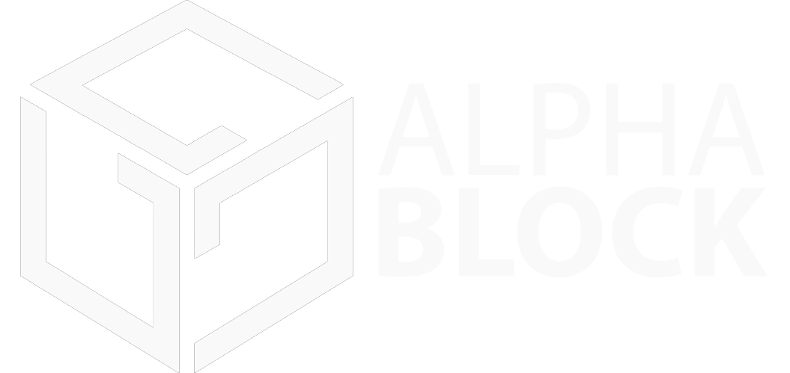
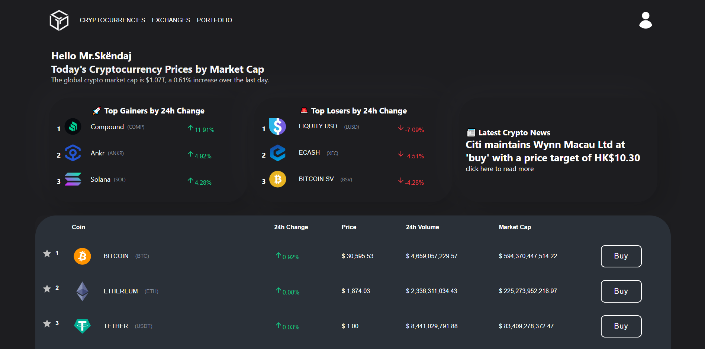

# AlphaBlock

AlphaBlock is a powerful MERN Stack (MongoDB, Express.js, React.js, Node.js) application designed to provide real-time price tracking, insightful graphics, user interaction through comments, and simulated transfers between users. This app aims to empower users with comprehensive financial information and a collaborative platform for discussing market trends.

## Key Features

- Real-time Price Tracking: AlphaBlock leverages live data feeds to provide up-to-date market prices, allowing users to monitor their favorite assets in real-time.

- Informative Graphics: Gain a deeper understanding of market trends and performance through visually appealing and interactive graphs, which are generated using comprehensive historical and real-time data.

- User Interaction: AlphaBlock fosters a sense of community by enabling users to comment on assets, share insights, and engage in meaningful discussions about market trends, investment strategies, and more.

- Simulated Transfers: Users can simulate transfers between accounts, offering an opportunity to practice financial management and evaluate the impact of various transactions.

Please note that AlphaBlock is currently under development, and additional features and improvements will be added in future updates.

## Installation

1. Clone the repository: `git clone https://github.com/your-username/alphablock.git`
2. Install dependencies for the server: `cd server && npm install`
3. Install dependencies for the client: `cd client && npm install`
4. Start the server: `cd server && npm start`
5. Start the client: `cd client && npm start`
6. Open your browser and visit: `http://localhost:3000`

## Contact

If you have any questions or feedback, please feel free to reach out to us at [skendajbruno07@gmail.com](mailto:skendajbruno07@gmail.com).
